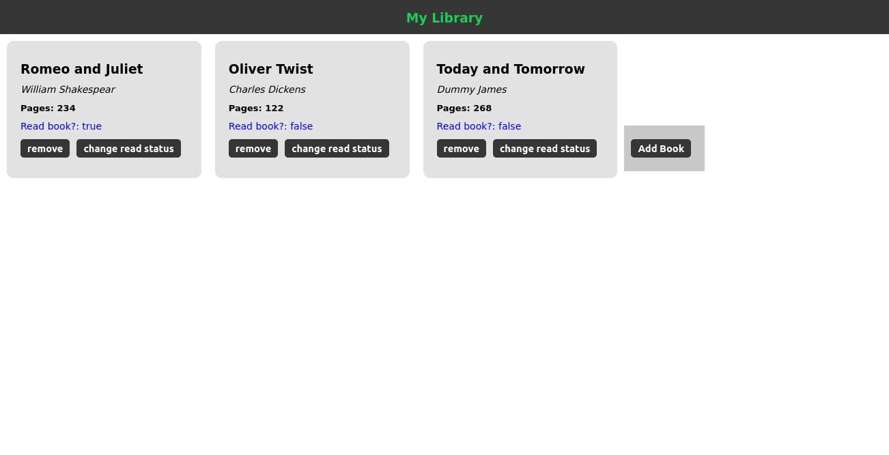
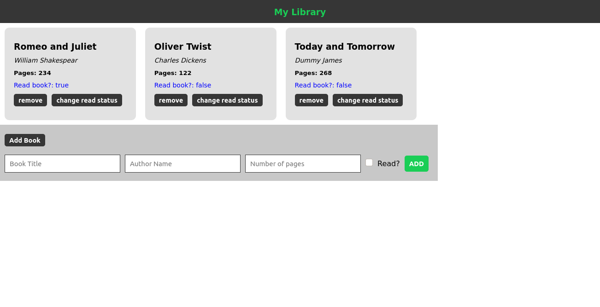

# LIBRARY

## Definition

An online library for a user to populate with his/her favourite books.

## About the Project

This project is about building a website which acts an online library. This project is about using Javascript to manipilate the DOM adding and removing elements as well as changing the contents while making use of Objects and functions.


-


The DOM Elements are build mainly from JS:
The JS has the following structure

- Book object
- displayHeader function
- displayBooks function
- displayForm fucntion
- Related callback functions to add and remove book while updating the DOM

## Built With

- HTML5
- CSS3
- Javascript

## Live Demo

[Live Demo Link](https://misori-simon.github.io/library/)


## Getting Started

**Just clone this repo and open index.html file in your browser then you are good to go.**


**To get a local copy up and running follow these simple example steps.**

### clone the repo.
- in your terminal,  run
``` git clone https://github.com/Misori-simon/library.git ```
- open the directory
``` cd library```
- Open the ``` index.html``` file in the browser.


## Authors

👤 **Misori Simon**

- GitHub: [Misori-simon](https://github.com/Misori-simon/)
- Twitter: [@misori_simon](https://twitter.com/misori_simon)
- LinkedIn: [Misori Simon](https://cm.linkedin.com/in/misori-simon-05906219b)

👤 **Nick Kuria**

- GitHub: [@Nkuria](https://github.com/Nkuria)
- Twitter: [@Nkuria](https://twitter.com/Nkuria3)
- LinkedIn: [Nick Kuria](hhttps://www.linkedin.com/in/nick-kuria-a148931a9/)

## 🤝 Contributing

Contributions, issues, and feature requests are welcome!

## Show your support

Give a ⭐️ if you like this project!

## Acknowledgments

-  [The Odin Project](https://www.theodinproject.com/)
